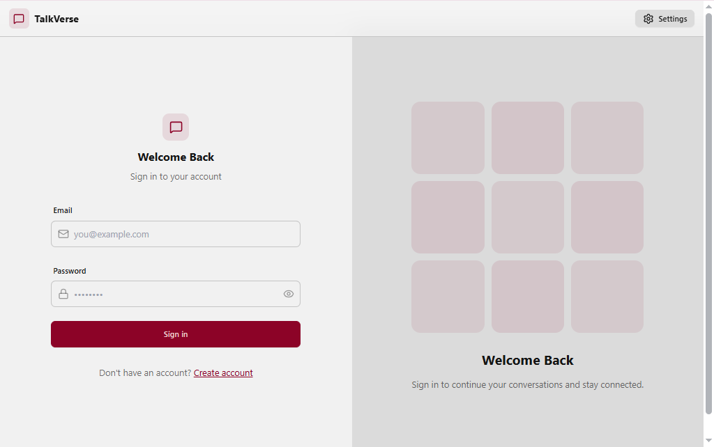
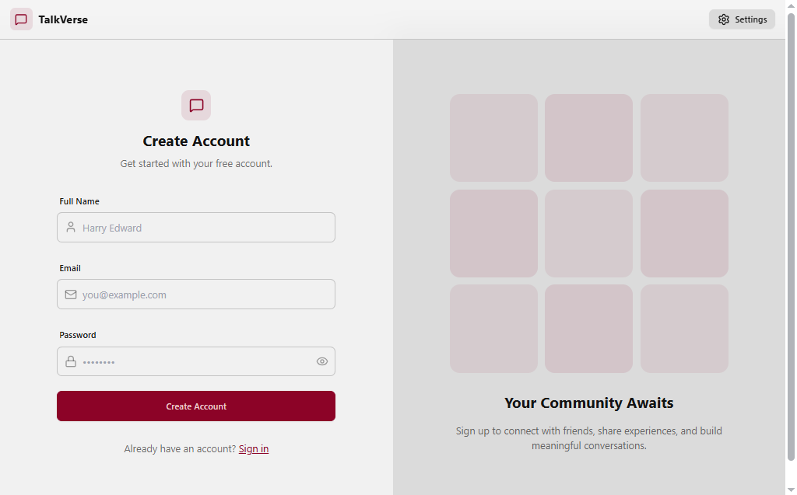
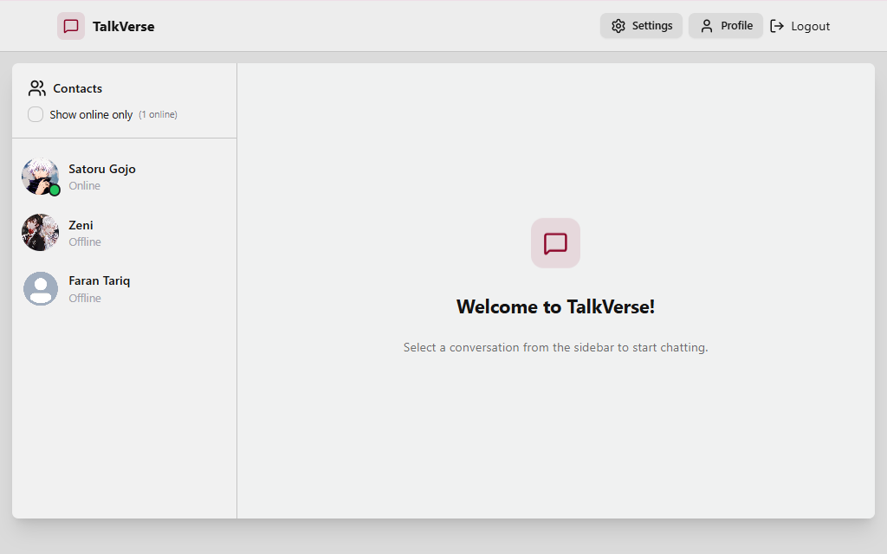
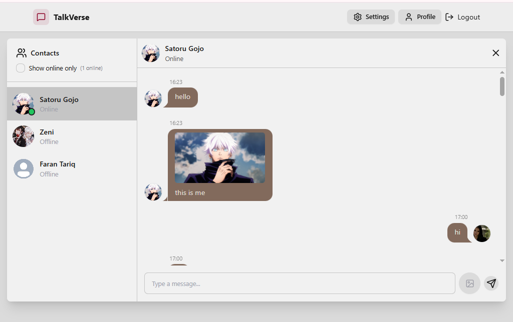
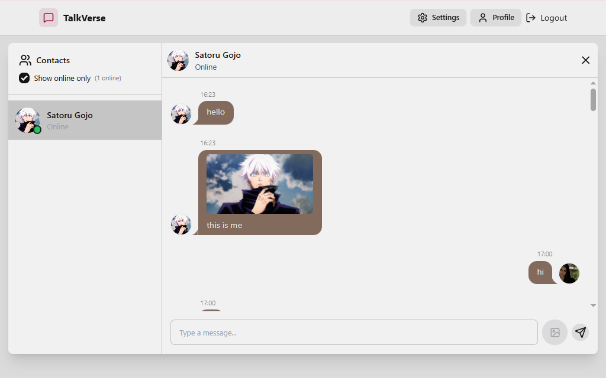
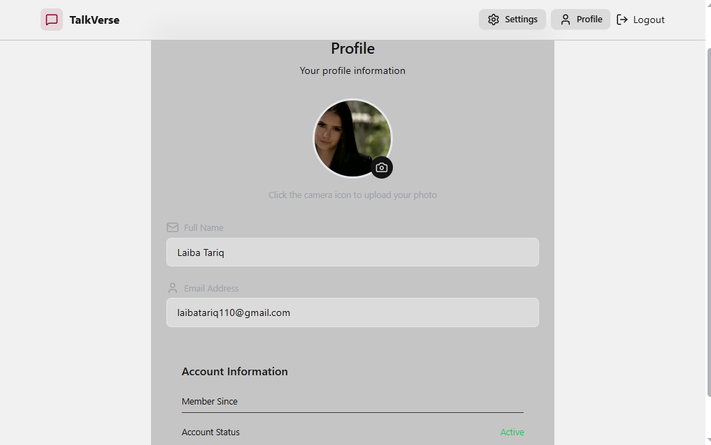
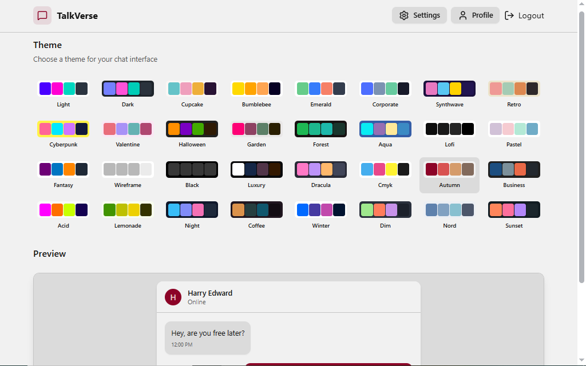

# 💬 Realtime Chat App

A full-stack realtime chat application built with the MERN stack and Socket.io, supporting instant messaging, authentication, and online user tracking.

---

## 🌐 Live Demo

🔗 https://realtime-chat-app-tnkq.onrender.com

---

## 🚀 Features

- 🔐 User authentication (JWT + cookies)
- 💬 Realtime messaging with Socket.io
- 🟢 Online users indicator
- 🖼️ Image sharing via Cloudinary
- ⚡ Fast and responsive UI
- 📱 Mobile-friendly design

---

## 🛠️ Tech Stack

- Frontend: React, Tailwind CSS, DaisyUI, Zustand  
- Backend: Node.js, Express.js  
- Database: MongoDB  
- Realtime: Socket.io  
- Other: Cloudinary, Axios  
- UI Utilities: React Hot Toast, Lucide React

---

## 📸 Screenshots

### 🔐 Login Page

### 🔐 Signup Page

### 🏠 Homepage

### 💬 Chat Interface

### 🟢 Online Users

### 👤 Profile Page

### ⚙️ Settings Page

---

## ⚙️ Environment Variables

Create a `.env` file in the backend:

PORT=5001  
MONGODB_URI=your_mongodb_uri  
JWT_SECRET=your_secret_key  
CLOUDINARY_CLOUD_NAME=your_cloud_name  
CLOUDINARY_API_KEY=your_api_key  
CLOUDINARY_API_SECRET=your_api_secret  
CLIENT_URL=http://localhost:5173  

---

## 🧪 Run Locally

1. Clone the repo  
git clone https://github.com/laibatariq110/realtime-chat-app.git  
cd realtime-chat-app  

2. Install dependencies  
npm install --prefix backend  
npm install --prefix frontend  

3. Start the app  
npm run dev --prefix backend  
npm run dev --prefix frontend  

---

## 🌐 Deployment

The app is deployed using Render.  
Make sure to configure environment variables in your hosting platform.

---

## 🧠 Challenges & Fixes

- Fixed messaging and socket issues caused by incorrect `_id` reference in user authentication flow

---
